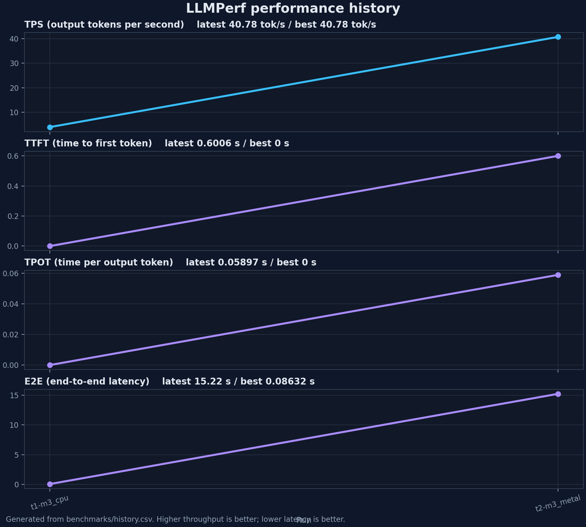

# infer

A minimal inference engine built from scratch in Rust. Designed for a single RTX 5090. No frameworks, no black boxes — every tensor shape and operation is explicit.

The goal is to understand what goes into LLM inference by building it, then systematically close the performance gap against production engines.

## Project layout

```
src/
  main.rs       — autoregressive loop, sampling, output
  api.rs        — OpenAI-compatible HTTP API (chat completions with SSE streaming)
benchmarks/
  bench.sh      — build + serve + benchmark + teardown (one command)
  report.py     — records LLMPerf summaries and generates charts
  history.csv   — durable benchmark history used by generated charts
  llmperf/      — LLMPerf load-test runner used by the benchmark
course/         — Python educational materials (transformers + inference deep dives)
```

## Benchmarking

```bash
./benchmarks/bench.sh
```

`bench.sh` builds the release binary, starts the OpenAI-compatible server, runs one fixed LLMPerf workload, records the run in `benchmarks/history.csv`, and regenerates the chart below. Raw LLMPerf output is saved under `benchmarks/results/`.

The benchmark is intentionally fixed: Llama 3.2 3B, 1 concurrent request, 5 completed requests, 550 input tokens, 256 requested output tokens, `temperature=0.0`, `seed=42`. Each run gets a unique label like `t1-m3_cpu`, `t2-m3_metal`, or `t4-rtx_5090-flash_attention`.



### Results

`TPS` is output tokens per second. `TTFT` is time to first token. `TPOT` is time per output token. Lower latency is better; higher TPS is better.

| Run | Date | Platform | Precision | Model | Optimization | tok/s | TTFT p50 (s) | TTFT p95 (s) | TPOT p50 (s) | TPOT p95 (s) | E2E p50 (s) | E2E p95 (s) | Requests | Errors | Notes |
|---|---|---|---|---|---|---:|---:|---:|---:|---:|---:|---:|---:|---:|---|
| t1-m3_cpu | 2026-06-29 | m3_cpu | BF16 | Llama 3.2 3B | CPU baseline | 3.88 | 0.000 | 0.000 | 0.0000 | 0.0000 | 0.086 | 0.097 | 5 | 0 | Naive Candle CPU path, KV cache, no attention/kernel optimizations |
| t2-m3_metal | 2026-06-29 | m3_metal | BF16 | Llama 3.2 3B | Metal baseline | 40.78 | 0.601 | 1.292 | 0.0590 | 0.0611 | 15.216 | 15.774 | 5 | 0 | Naive Candle Metal path, KV cache, no attention/kernel optimizations |

## License

MIT
